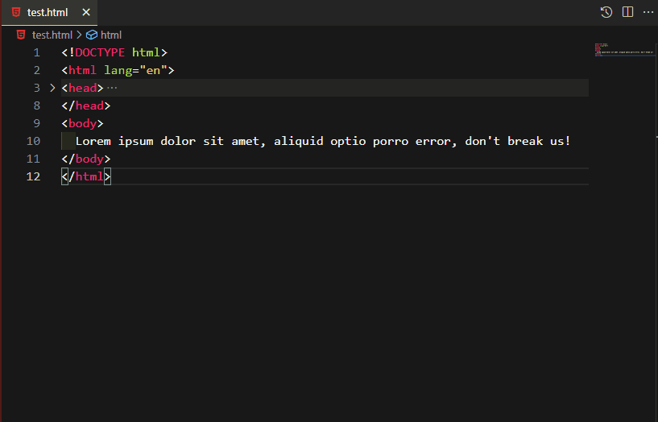

# tie-selected-words README

Use a span tag with nonbreaking spaces around and between your selected words so they don't break in different screen sizes.

## Features

**Unsupported scenarios**
* If your selection spans multiple lines
* If you make multiple selections, only the last selection in the document will be treated.

## Keyboard shortcut binding
If you wish to make use of keyboard shortcuts to run the command, please go to |files -> preference -> keyboard shortcuts|, search for "tie selected words" and add your own keyboard shortcut to it.